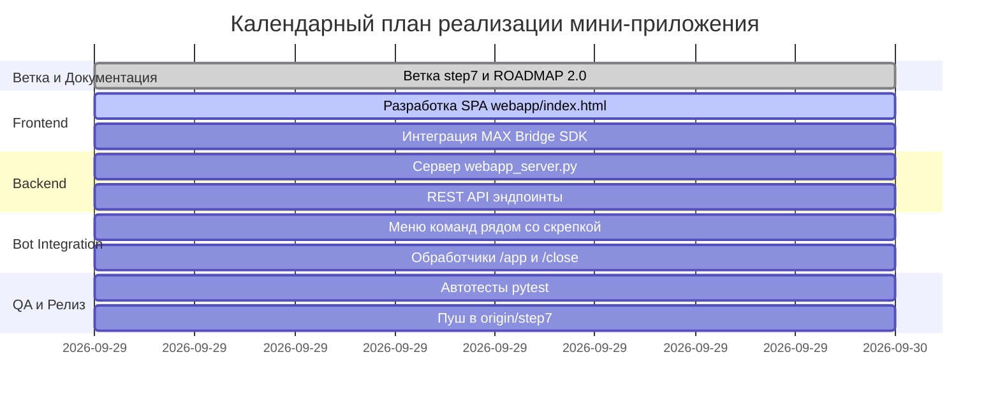

# Дорожная карта разработки (ROADMAP 2.0): Мини-приложение «Образовательные решения» (МАХ)

> **Цель этапа:** Переход от текстового интерфейса чат-бота к интерактивному мини-приложению (Mini App / Web App) внутри мессенджера МАХ для решения задач по математике (7 класс, формулы сокращенного умножения), визуализации статистики и методической помощи учителям.  
> **Ключевой фокус:** Удобный UX на смартфонах и десктопе, меню команд рядом со скрепкой (полем прикрепления файлов 📎), бесшовный вызов и закрытие приложения, интеграция с нативным мостом **MAX Bridge**.

---

## 1. Архитектура взаимодействия мини-приложения с МАХ

Интерактивное мини-приложение работает по архитектуре гибридного клиент-серверного WebApp внутри WebView мессенджера МАХ:

```mermaid
graph TD
    User([Пользователь в МАХ]) -->|Нажатие [ / ] Меню рядом со скрепкой| ChatMenu[Меню команд чата]
    ChatMenu -->|Команда /app| BotHandler[Обработчик handle_app]
    BotHandler -->|Сообщение с кнопкой open_app / link| AppButton[Кнопка «🚀 Открыть тренажёр»]
    AppButton -->|Запуск WebView| MiniApp[SPA Frontend: webapp/index.html]
    User -->|Диплинк startapp| MiniApp
    
    subgraph MAX Client
        MiniApp <-->|MAX Bridge window.WebApp| NativeBridge[MAX Bridge JS SDK]
        NativeBridge -->|initData / user / theme| MiniApp
        MiniApp -->|WebApp.close| NativeBridge
    end
    
    subgraph Local / Server Backend
        MiniApp <-->|REST API JSON| WebAppServer[webapp_server.py]
        WebAppServer <--> Database[(SQLite: math_bot.db)]
        WebAppServer <--> MathEngine[TaskGenerator & Validator]
    end
```

### Основные компоненты системы:
1. **Chat Bar Menu Button (Меню команд рядом со скрепкой):**
   - Мессенджер МАХ отображает кнопку меню команд `[ / ]` непосредственно в строке ввода сообщения рядом с ячейкой прикрепления файлов (скрепкой 📎).
   - Список команд синхронизируется через `PATCH /me/commands` API МАХ.
   - Пользователь в один клик вызывает `/app` (запуск тренажёра) или `/close` (закрытие сессии).
2. **MAX Bridge SDK (`https://st.max.ru/js/max-web-app.js`):**
   - Нативный объект `window.WebApp`, предоставляющий:
     - `WebApp.ready()` — сигнал клиенту о завершении загрузки DOM.
     - `WebApp.close()` — штатное сворачивание/закрытие мини-приложения в WebView.
     - `WebApp.initData` и `WebApp.initDataUnsafe` — авторизационные данные и профиль (`user.id`, `user.first_name`).
     - `WebApp.themeParams` — синхронизация цветовой темы (светлая/тёмная) с клиентом МАХ.
3. **Frontend SPA (`webapp/index.html`):**
   - Адаптивный веб-интерфейс, оптимизированный под экраны мобильных устройств от 375px.
   - 4 функциональных раздела (вкладки): Тренажёр, Статистика, Для учителя, Справочник 30 формул.
4. **Backend Web Server (`webapp_server.py`):**
   - Многопоточный HTTP-сервер стандартной библиотеки Python (`http.server.ThreadingHTTPServer`).
   - Раздача статики и маршрутизация REST API без внешних тяжелых зависимостей.

---

## 2. Спецификация меню команд рядом со скрепкой (Chat Bar Menu)

Для того чтобы пользователь мог в любой момент комфортно вызвать приложение или вернуться к диалогу с ботом, настраиваются системные команды через метод `PATCH /me/commands`:

| Команда | Описание в меню МАХ | Действие |
| :--- | :--- | :--- |
| **`/app`** | 🚀 Открыть тренажёр | Отправляет интерактивную карточку запуска тренажёра с прямой кнопкой `link` |
| **`/close`** | ❌ Закрыть тренажёр | Сбрасывает активную сессию и отправляет подтверждение закрытия приложения |
| **`/task`** | 🎯 Решать задачи в чате | Выдача случайной задачи по 30 шаблонам текстовым сообщением |
| **`/stats`** | 📊 Моя статистика успеваемости | Показ процента точности, количества решенных задач и уровня мастерства |
| **`/lesson`** | 📚 План урока на 45 минут | Генерация структурированного конспекта для учителя |
| **`/help`** | 📖 Справка и правила ввода | Инструкция по степеням (`^2`, `^3`), скобкам и раскладке |
| **`/start`** | 🔄 Главное меню и перезапуск | Приветственное сообщение с описанием тренажёра и мини-приложения |
| **`/cancel`** | ⏹ Отменить текущее действие | Сброс шага решения и возврат в главное меню |

> **Расположение в интерфейсе МАХ:** После вызова `client.set_my_commands()` в поле ввода чата (слева от текстовой строки или рядом со значком 📎) появляется постоянная кнопка меню. При нажатии на неё всплывает список команд с описаниями.

---

## 3. Функциональные модули мини-приложения (SPA)

### Вкладка 1: 🎯 Тренажёр (Интерактивное решение)
* **Карточка задачи:** Крупное визуальное отображение формулы (например: `Раскройте скобки: (3x - 4)(3x + 4)`).
* **Виртуальная математическая клавиатура:** Набор быстрых кнопок под полем ввода для мобильных экранов:
  - `^2`, `^3`, `x`, `y`, `a`, `b`, `+`, `-`, `(`, `)`.
  - Исключает необходимость переключать системную клавиатуру на символы и степени.
* **Мгновенная валидация:**
  - Отправка ответа на `/api/check`.
  - Визуальная обратная связь: зеленая анимация при успехе, мягкая красная индикация с подсказкой при ошибке.
  - Кнопка «Показать подсказку правила» с отображением соответствующего эталонного шаблона.
* **Счетчик серии:** Учет текущей серии верных ответов (Streak counter).

### Вкладка 2: 📊 Моя статистика (Личный кабинет)
* **Визуальный прогресс:** Круговой или линейный индикатор общей точности (% accuracy).
* **Бейджи мастерства:**
  - `🌱 Ученик` (< 50% точности)
  - `🥈 Практик` (50% – 79%)
  - `🏆 Эксперт ФСУ` (>= 80% точности)
* **Метрики:** Всего решено задач, верных ответов, процент качества.
* **История недавних попыток:** Таблица последних 5 заданий с индикаторами ✅ / ❌.

### Вкладка 3: 📚 Для учителя (Методический блок)
* **Генератор 45-минутного плана урока:**
  - Разминка (5 мин) — 3 устные задачи.
  - Изучение нового (15 мин) — теория и работа у доски.
  - Закрепление (20 мин) — самостоятельная практика с нарастающей сложностью.
  - Домашнее задание (5 мин) — блок задач с ответами для быстрой проверки.
* **Генератор варианта на 15 задач:**
  - Создание сбалансированного набора задач на все 30 шаблонов ФСУ.
* **Экспорт:** Кнопка «Скопировать в буфер обмена» и возможность печати/сохранения в PDF/Markdown.

### Вкладка 4: 💡 Справочник (30 шаблонов Степана)
* **Категории:**
  1. Разность квадратов (Шаблоны 1–7)
  2. Квадрат суммы и разности (Шаблоны 8–20)
  3. Кубы и разложение на множители (Шаблоны 21–30)
* **Интерактивный фильтр:** Быстрый поиск по шаблону формулы или названию.
* **Интерактивный тест:** Кнопка «Потренировать этот шаблон» прямо из справочника.

### Верхняя панель (Header):
* Иконка и статус тренажёра.
* Имя ученика / учителя из `window.WebApp.initDataUnsafe.user`.
* Кнопка **«✕ Закрыть»** — вызывает метод `window.WebApp.close()` для мгновенного возврата в чат.

---

## 4. Спецификация REST API (`webapp_server.py`)

Сервер обрабатывает JSON-запросы на порту `8080` (настраивается через `WEBAPP_PORT`):

### 1. `GET /api/task`
* **Параметры:** `user_id` (string), `template_id` (int, опционально).
* **Ответ:**
  ```json
  {
    "status": "ok",
    "template_id": 3,
    "task_id": 142,
    "question": "Раскройте скобки: (3x - 4)(3x + 4)",
    "category": "Разность квадратов"
  }
  ```

### 2. `POST /api/check`
* **Тело запроса:**
  ```json
  {
    "user_id": "123456",
    "task_id": 142,
    "user_answer": "9x^2 - 16"
  }
  ```
* **Ответ:**
  ```json
  {
    "status": "ok",
    "is_correct": true,
    "expected_answer": "9x^2-16",
    "feedback": "Абсолютно верно!",
    "stats": {
      "total_solved": 15,
      "correct_answers": 13,
      "accuracy_percent": 86.7
    }
  }
  ```

### 3. `GET /api/stats`
* **Параметры:** `user_id` (string).
* **Ответ:**
  ```json
  {
    "status": "ok",
    "user_id": "123456",
    "total_solved": 15,
    "correct_answers": 13,
    "accuracy_percent": 86.7,
    "rank": "Эксперт ФСУ",
    "history": [...]
  }
  ```

### 4. `POST /api/lesson`
* **Тело запроса:** `{"topic": "ФСУ (7 класс)", "grade": 7, "author_id": "teacher_1"}`
* **Ответ:**
  ```json
  {
    "status": "ok",
    "topic": "ФСУ (7 класс)",
    "markdown": "# План урока...",
    "variant_15": "..."
  }
  ```

### 5. `GET /api/templates`
* **Ответ:** Список всех 30 структурированных шаблонов ФСУ с формулами и описанием.

### 6. `GET /health`
* **Ответ:** `{"status": "ok", "service": "max-math-webapp"}`

---

## 5. Пошаговые этапы реализации (Step 7)



### Контрольные точки приемки:
1. **Тест открытия из меню:** Нажатие на меню рядом со скрепкой $\to$ выбор `/app` $\to$ бот отправляет карточку с кнопкой запуска приложения.
2. **Тест работы в WebView:** Приложение корректно загружается, инициализирует `window.WebApp`, отображает имя пользователя и активную вкладку тренажёра.
3. **Тест экранной клавиатуры:** Ввод ответа через математические кнопки `^2`, `x`, `+` работает корректно и без ошибок.
4. **Тест кнопки «Закрыть»:** Кнопка «✕ Закрыть» в шапке вызывает `window.WebApp.close()`, а команда чата `/close` подтверждает завершение сеанса.
5. **Тест регрессии:** Все существующие автотесты бота (24 шт.) и новые тесты WebApp выполняются со 100% успехом.
